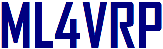

# ML4VRP Competition Resources

This repository is used for the Machine Learning for Evolutionary Computation - for Vehicle Routing Problems ([ML4VRP](https://sites.google.com/view/ml4vrp)) competition in [GECCO 2023](https://gecco-2023.sigevo.org/Call-for-Competition-Entries). 

<!--This competition aims to serve as a vehicle to bring together the latest developments of machine learning-assisted evolutionary computation for vehicle routing problems (VRPs). The focus of this competition is on solving VRP with Time Window constraints (VRPTW). 

Participants must submit descriptions of the developed algorithms and the produced solutions for the corresponding VRPTW instances. Submissions of the produced solutions for the corresponding VRPTW instances will be evaluated on randomly selected instances from the provided VRPTW instances with an evaluator. The most widely adapted evaluation function, i.e. to minimise the number of vehicles and total travel distance, is used to determine the best machine learning assisted evolutionary algorithms for solving VRPs. The algorithms which produced the best average fitness for solving VRPs will receive the highest score. -->

In this repository, you will find:
- [VRPTW Problem Data](#vrps) for the competition
- [API evaluator](#api) (available soon!)

## <a id='vrps'>VRPTW Problem Data </a>
Solomon [Sol87] dataset and Homberger and Gehring [HG99] data set are widely studied VRPTW benchmark data sets. Both data sets consist of [six types of instances](http://web.cba.neu.edu/~msolomon/problems.htm), i.e., C1, C2, R1, R2, RC1, RC2, which differ with respect to the customers’ geographical locations, vehicle capacity, density and tightness of the time windows. 

The problem instances provided in the competition are taken from two sources, i.e., 
- Solomon [Sol87] dataset of 100 customer problems,
- Homberger and Gehring [HG99] data sets of 200 customer problems and 400 customer problems.

The provided problem instances provided are randomly selected from these three sized problem instances, covering different instance types. The competition will conduct the evaluation of the submitted solution results using a subset of the provided instances (unknown to the participants before the results are presented). 

The problem instances provided in the competition are available to download on the folder [Instances](https://github.com/ML4VRP2023/ML4VRP2023/tree/main/Instances) of this repo. All the VRPTW instances can also be found in [CVRPLIB](http://vrp.galgos.inf.puc-rio.br/index.php/en/). 

## <a id='api'>API Evaluator </a>
API evaluator with instructions to evaluate the solutions will be available soon!
 

## Organisers
Rong Qu,         University of Nottingham, UK, rong.qu@nottingham.ac.uk

Nelishia Pillay, University of Pretoria, South Africa, nelishia.pillay@up.ac.za

Weiyao Meng, University of Nottingham, UK, weiyao.meng2@nottingham.ac.uk

## References
[HG99] J. Homberger and H. Gehring, "Two evolutionary metaheuristics for the vehicle routing problem with time windows," INFOR: Information Systems and Operational Research, 37(3):297–318, 1999. [PDF](https://citeseerx.ist.psu.edu/document?repid=rep1&type=pdf&doi=a34e12bf0a30deb56233c26d82a0979987bb6ce4)

[Sol87] M. M. Solomon, "Algorithms for the vehicle routing and scheduling problems with time window constraints," Operations Research, 35(2):254–265, 1987. [PDF](https://www.jstor.org/stable/pdf/170697.pdf?casa_token=ltF2XRa2-nAAAAAA:OV4ClhhdAM_ds_p3-XIzKaz3hDYb9Jy2yHa7-jniGyYLzy2Rg2JC1b-ope2_gtsoQ1eOfFcgeTvtFmGZdPWDACEySwlfASLdRl-mhJRQE4f_6Kc5jJRnYg)